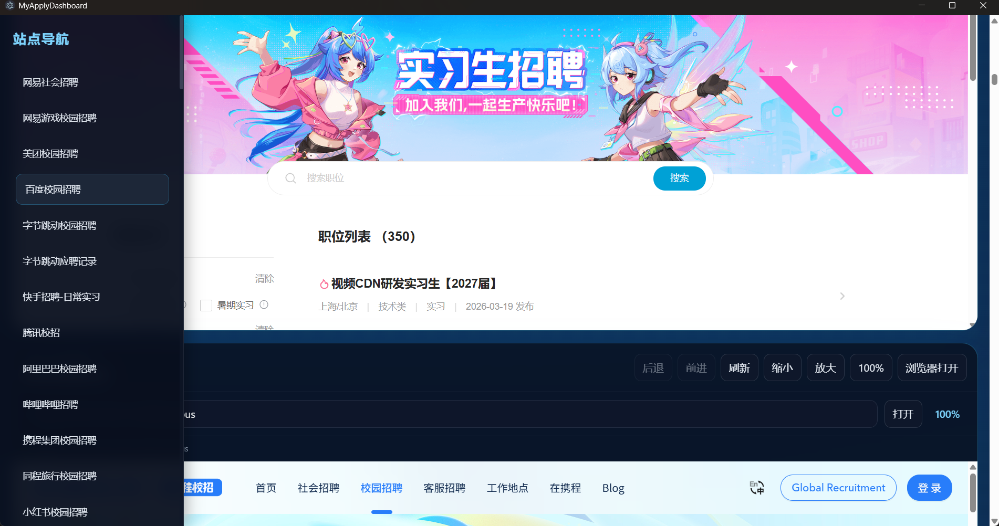
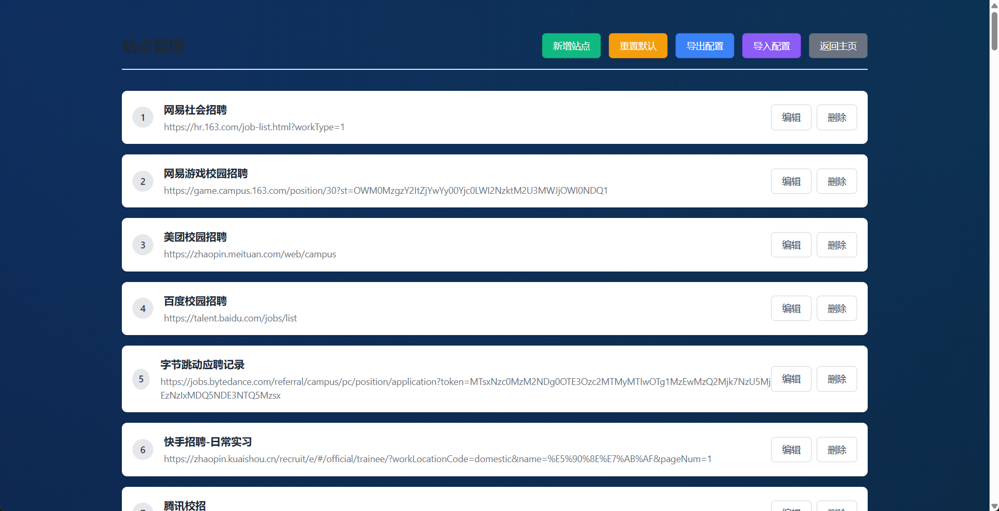

# MyApplyDashboard

招聘官网看板 - 基于 Electron + Vue 3 的多窗口招聘网站管理工具

## 项目简介

MyApplyDashboard 是一款专为求职者设计的桌面应用，旨在解决在多个招聘官网之间反复切换、管理职位信息时效率低下的问题。

在秋招、春招或实习投递过程中，求职者往往需要在浏览器中打开大量招聘网站的标签页，查看投递进度、职位详情等信息，操作繁琐且容易遗漏。
MyApplyDashboard 通过 Electron 和 Vue 3 技术栈，将这些网站整合到一个应用中，每个网站以独立卡片的形式展示，支持同时监控和管理多个招聘平台的职位信息，帮助用户高效完成求职申请流程。

## 系统运行截图





## 功能特性

- **多站聚合**：集成了 80+ 家互联网公司的招聘官网，包括网易、美团、百度、字节跳动、腾讯、阿里巴巴等
- **独立面板**：每个招聘网站独立显示在卡片中，支持同时浏览多个网站
- **导航功能**：每个面板配备完整的浏览器导航功能（前进、后退、刷新）
- **缩放控制**：支持页面放大、缩小和重置，适配不同显示需求
- **快捷侧边栏**：提供站点导航侧边栏，可快速跳转到目标公司面板
- **外部打开**：支持一键在默认浏览器中打开招聘网站
- **实时状态**：显示页面加载状态和当前 URL
- **自动保存**：使用持久化分区保存各网站的登录状态和浏览记录
- **站点管理**：支持对招聘网站进行增删改查管理，可自定义网站列表

## 技术栈

- **框架**: Electron 37.2.0
- **前端**: Vue 3.5.30 + Vite 5.4.19
- **构建工具**: @vitejs/plugin-vue
- **开发工具**: concurrently, wait-on

## 项目结构

```
MyApplyDashboard/
├── electron/                 # Electron 主进程
│   ├── main.js              # Electron 主进程入口
│   └── preload.js           # 预加载脚本
├── src/                      # 前端源码
│   ├── config/              # 配置文件
│   │   └── sites.js         # 招聘网站配置列表
│   ├── App.vue              # 主应用组件
│   ├── main.js              # Vue 应用入口
│   └── style.css            # 全局样式
├── dist/                     # 构建输出目录
├── index.html                # HTML 模板
├── package.json              # 项目配置和依赖
└── vite.config.js           # Vite 构建配置
```

## 安装与运行

### 环境要求

- Node.js >= 16
- npm >= 8

### 安装依赖

```bash
npm install
```

### 开发模式

```bash
npm run dev
```

此命令会同时启动 Vite 开发服务器和 Electron 应用。

### 打包构建

```bash
npm run build
```

### 直接运行 Electron

```bash
npm start
```

## 配置招聘网站

您可以通过以下两种方式自定义要监控的招聘网站：

### 方式一：通过站点管理界面（推荐）

1. 点击应用右上角的「**站点管理**」按钮
2. 在管理页面中可以进行以下操作：
   - **新增站点**：点击「新增站点」按钮，填写网站名称和 URL
   - **编辑站点**：点击任意站点的「编辑」按钮，修改信息
   - **删除站点**：点击「删除」按钮移除不需要的网站
   - **重置默认**：恢复到初始配置
   - **导出配置**：备份当前站点配置为 JSON 文件
   - **导入配置**：从 JSON 文件恢复站点配置
3. 所有修改会自动保存到 `src/config/sites.js` 文件和本地存储
4. 点击「返回主页」即可看到更新后的网站列表

### 方式二：直接编辑配置文件

你可以通过编辑 `src/config/sites.js` 文件来自定义要监控的招聘网站：

```javascript
export default [
  {
    id: 'unique-id',
    title: '网站标题',
    url: 'https://recruitment-website-url.com'
  },
  // 添加更多网站...
]
```

每个网站配置包含以下字段：

- `id`: 网站唯一标识符（建议使用小写字母和连字符）
- `title`: 显示在面板上的标题
- `url`: 招聘网站的初始 URL 地址

**注意**：通过方式二修改后需要重启应用才能生效。建议优先使用方式一的图形界面进行管理。

## 使用说明

1. **浏览职位**：应用启动后会自动加载所有配置的招聘网站
2. **导航操作**：使用每个面板顶部的按钮进行前进、后退、刷新等操作
3. **页面缩放**：通过放大/缩小按钮调整页面显示比例（50%-200%）
4. **快速跳转**：鼠标悬停在左侧区域显示站点导航，点击可快速定位到目标公司
5. **输入网址**：在地址栏输入新的 URL 后按回车或点击"打开"按钮即可访问
6. **外部打开**：点击"浏览器打开"按钮可在系统默认浏览器中打开当前页面

## 支持的招聘网站

目前已集成 80+ 家公司的招聘官网，涵盖：

- **互联网大厂**：网易、腾讯、阿里巴巴、字节跳动、美团、百度、快手等
- **游戏公司**：米哈游、莉莉丝、库洛游戏、叠纸游戏、鹰角网络等
- **智能硬件**：小米、OPPO、vivo、华为、荣耀、大疆等
- **人工智能**：商汤科技、旷视科技、依图科技、云从科技等
- **新能源汽车**：蔚来、小鹏、理想等
- **其他知名企业**：拼多多、小红书、哔哩哔哩、携程、唯品会等

## 开发说明

### 添加新的招聘网站

1. 在 `src/config/sites.js` 中添加新的网站配置对象
2. 确保 `id` 字段唯一
3. 重启应用即可看到新添加的网站

### 修改界面样式

- 全局样式位于 `src/style.css`
- 组件样式在 `src/App.vue` 的 `<style>` 标签中

### Electron 相关配置

- 主进程逻辑在 `electron/main.js`
- 预加载脚本在 `electron/preload.js`
- 可在此处添加自定义的 Electron API

## 注意事项

- 部分招聘网站可能需要登录才能查看完整职位信息
- 某些网站可能有反爬虫机制，建议合理使用刷新功能
- 建议在稳定的网络环境下使用，以确保页面正常加载
- 如需清除浏览数据，可删除 Electron 的应用数据目录

## 许可证

MIT License

## 贡献

欢迎提交 Issue 和 Pull Request 来帮助改进这个项目！

## 致谢

感谢所有为求职招聘平台做出贡献的开发者和公司。

---

**提示**: 本项目仅供学习交流使用，请遵守各招聘网站的使用条款和机器人协议。
